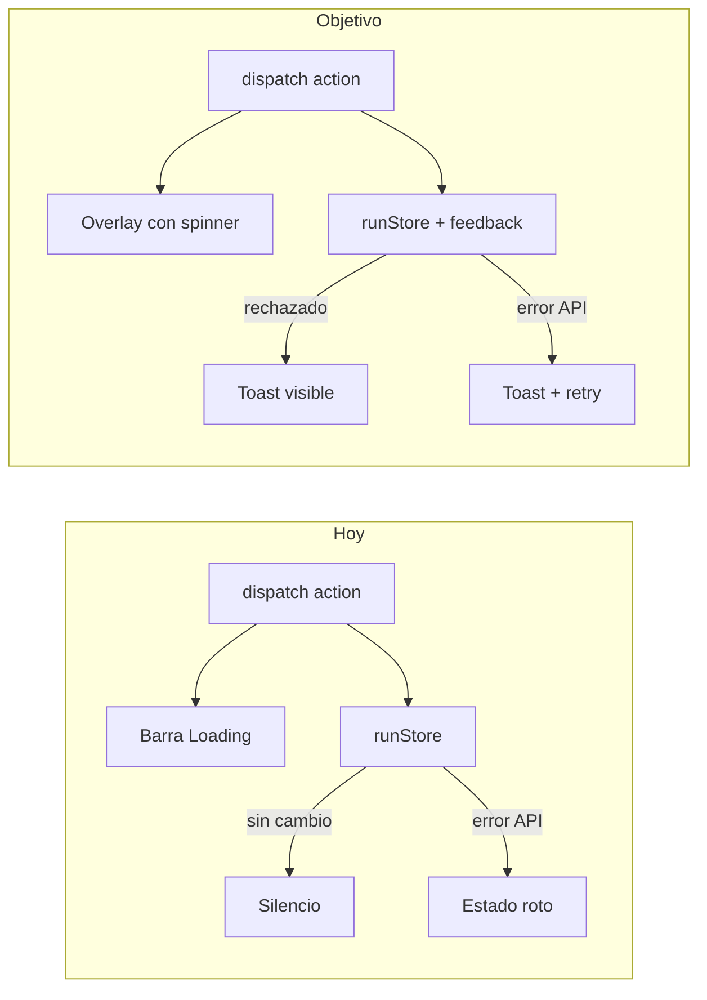

# Plan: Mejora integral UI/UX (CSS-only)

## Estado actual

PokeCards es una SPA React 19 con navegación por `RunState.screen` en [`App.tsx`](E:/REPOS/PokeCards/src/App.tsx), estilos globales en [`index.css`](E:/REPOS/PokeCards/src/index.css) (~800 líneas), y estética "felt table" verde oscuro + acentos dorados. Funciona, pero la UX tiene huecos claros:

- Loading: barra fija `"Loading..."` en cada `dispatch`, sin spinner ni debounce
- Errores: PokéAPI falla silenciosamente ([`StarterSelect.tsx`](E:/REPOS/PokeCards/src/screens/StarterSelect.tsx) sin `.catch()`); [`useRunState.ts`](E:/REPOS/PokeCards/src/state/useRunState.ts) sin `try/catch`
- Acciones rechazadas: [`runStore.ts`](E:/REPOS/PokeCards/src/state/runStore.ts) devuelve `state` sin cambios (oro insuficiente, nodo no disponible, etc.) — el usuario no recibe feedback
- Mobile: único breakpoint a 600px aplasta el mapa a una columna, perdiendo la metáfora de rutas
- Batalla: `busy` existe pero no hay indicador visual de turno enemigo / bloqueo



---

## Fase 1 — Infraestructura UX (base para todo lo demás)

### 1.1 Sistema de toasts (CSS puro)

Crear [`src/components/Toast.tsx`](E:/REPOS/PokeCards/src/components/Toast.tsx) + [`src/state/toastStore.ts`](E:/REPOS/PokeCards/src/state/toastStore.ts) (hook simple, sin librería):

- Tipos: `success | error | info`
- API: `showToast({ message, kind, duration? })`
- Contenedor fijo abajo-centro con animación `@keyframes toastIn/toastOut` en `index.css`
- `role="status"` + `aria-live="polite"` para accesibilidad

Montar `<ToastContainer />` en [`App.tsx`](E:/REPOS/PokeCards/src/App.tsx).

### 1.2 Feedback desde el store

Extender el retorno de `handleRunAction` en [`runStore.ts`](E:/REPOS/PokeCards/src/state/runStore.ts):

```typescript
type ActionResult = { state: RunState; toast?: { kind: ToastKind; message: string } }
```

Casos a cubrir con mensajes claros en español o inglés (mantener idioma actual del UI — hoy está en inglés):

| Acción | Condición | Mensaje |
|--------|-----------|---------|
| `BUY_ITEM` | oro insuficiente | "Not enough gold." |
| `USE_ITEM` | sin stock / target inválido | "Can't use that item right now." |
| `SELECT_NODE` | nodo no disponible / completado | "That route isn't available." |
| Rest node | éxito | "Team fully healed!" (toast success) |

En [`useRunState.ts`](E:/REPOS/PokeCards/src/state/useRunState.ts):

- `try/catch` alrededor de `handleRunAction`
- En error de red/API: toast error + mensaje genérico ("Something went wrong. Try again.")
- Si `result.toast` existe, llamar `showToast`
- **No re-lanzar** el error — mantener estado estable

### 1.3 Loading mejorado

Reemplazar `.global-loader` por overlay semitransparente con spinner CSS (`.loading-overlay` + `.spinner`):

- Debounce de 150ms antes de mostrar (evita flicker en acciones rápidas)
- Bloquear interacción solo cuando el overlay está visible
- Deshabilitar botones en pantallas que aún no lo hacen ([`PostBattleScreen`](E:/REPOS/PokeCards/src/screens/PostBattleScreen.tsx), [`EndScreen`](E:/REPOS/PokeCards/src/screens/EndScreen.tsx), botón "Back to Map" en market)

---

## Fase 2 — Design system ligero (tokens + componentes compartidos)

### 2.1 Ampliar tokens en [`index.css`](E:/REPOS/PokeCards/src/index.css)

Añadir variables reutilizables:

- `--radius-sm/md/lg`, `--space-*`, `--success`, `--error`, `--info`
- `:focus-visible` global en `.btn`, `.map-node`, `.move-card`, `.starter-card`
- `@media (prefers-reduced-motion: reduce)` — desactivar `fadeIn`, hover transforms, toast slide

### 2.2 Extraer componentes repetidos

| Componente | Origen | Uso |
|------------|--------|-----|
| [`GoldDisplay.tsx`](E:/REPOS/PokeCards/src/components/GoldDisplay.tsx) | duplicado en map + market | HUD consistente |
| [`ScreenHeader.tsx`](E:/REPOS/PokeCards/src/components/ScreenHeader.tsx) | headers repetidos | título + subtítulo + slot derecho |
| [`LoadingOverlay.tsx`](E:/REPOS/PokeCards/src/components/LoadingOverlay.tsx) | App.tsx | spinner reutilizable |

Opcional: mover [`RunMapView.tsx`](E:/REPOS/PokeCards/src/components/RunMapView.tsx) a `src/screens/` por consistencia arquitectónica (sin cambio funcional).

---

## Fase 3 — Pulido por pantalla

### Home ([`HomeScreen.tsx`](E:/REPOS/PokeCards/src/screens/HomeScreen.tsx))

- Fondo decorativo con pseudo-elementos CSS (cartas apiladas / felt texture sutil)
- Mejor jerarquía: eyebrow → título → tagline → CTAs con más espacio
- Estado hover/active más pronunciado en botones primarios

### Starter ([`StarterSelect.tsx`](E:/REPOS/PokeCards/src/screens/StarterSelect.tsx))

- Skeleton cards CSS mientras carga (3 placeholders animados con `@keyframes shimmer`)
- `.catch()` en fetch + pantalla de error con botón **Retry**
- Type badges con colores de [`typeColors.ts`](E:/REPOS/PokeCards/src/styles/typeColors.ts) (hoy todos usan `--border`)

### Mapa ([`RunMapView.tsx`](E:/REPOS/PokeCards/src/components/RunMapView.tsx))

- Reemplazar letras crípticas (`W/T/R/C/B`) por iconos descriptivos CSS/Unicode + tooltip nativo (`title` attribute):
  - Wild → "Tall Grass", Trainer → "Trainer", Rest → "Rest Stop", Catch → "Catch", Boss → "Gym Leader"
- Líneas conectoras entre filas con pseudo-elementos o SVG inline mínimo en el grid (CSS `::after` entre nodos de filas adyacentes)
- HUD sticky en scroll (`position: sticky; top: 0`) con fondo semitransparente
- Mostrar badges acumulados (`state.badges`) en el header — hoy existen en state pero no se muestran
- Party summary: barras HP mini (reutilizar lógica visual de `.hp-bar`) en lugar de solo texto

### Batalla ([`BattleScreen.tsx`](E:/REPOS/PokeCards/src/screens/BattleScreen.tsx) + componentes)

- Banner de turno: "Your turn" / "Enemy turn..." / "Choose a Pokémon" según `localBattle.turn` y `mustSwitch`
- Overlay `.battle-busy` cuando `busy === true` (spinner sobre el arena, no toda la pantalla)
- Battle log: `aria-live="polite"`, última línea resaltada, scroll suave
- [`CardHand.tsx`](E:/REPOS/PokeCards/src/components/CardHand.tsx): hover lift, estado disabled más claro, min-height táctil 48px
- [`PartyTray.tsx`](E:/REPOS/PokeCards/src/components/PartyTray.tsx): borde pulsante en slot activo, icono de desmayo en HP=0

### Mercado ([`MarketScreen.tsx`](E:/REPOS/PokeCards/src/screens/MarketScreen.tsx))

- Items no asequibles: clase `.shop-item.unaffordable` (opacidad + precio en rojo) además del botón disabled
- Toast al comprar con éxito ("Purchased Potion!")
- Target picker como panel modal CSS (`.modal-backdrop`) en lugar de inline — más claro en mobile

### Post-batalla ([`PostBattleScreen.tsx`](E:/REPOS/PokeCards/src/screens/PostBattleScreen.tsx))

- Tarjetas de recompensa con stagger animation (`animation-delay` por hijo)
- Nuevas move cards mostradas como mini `.move-card` usando colores de tipo
- Botón Continue deshabilitado durante loading

### Catch ([`CatchScreen.tsx`](E:/REPOS/PokeCards/src/screens/CatchScreen.tsx))

- Layout centrado tipo "encounter card" con borde dorado
- Type badges del Pokémon ofrecido
- Selección de reemplazo más evidente (checkmark overlay en `.replace-slot.selected`)

### Fin de run ([`EndScreen.tsx`](E:/REPOS/PokeCards/src/screens/EndScreen.tsx))

- Variantes visuales distintas: victory (brillo dorado, animación sutil) vs game-over (tonos rojizos apagados)
- Mostrar stats del run si están disponibles en state (gold final, party size, badges)

---

## Fase 4 — Mobile y accesibilidad

### Mapa en mobile (problema crítico)

**Eliminar** el colapso a 1 columna en `@media (max-width: 600px)` que destruye el grid.

**Reemplazar** con contenedor scroll horizontal:

```css
.map-scroll-wrap {
  overflow-x: auto;
  -webkit-overflow-scrolling: touch;
}
.map-grid {
  min-width: 320px; /* mantiene 3 columnas */
}
```

Añadir hint visual "Swipe to explore →" en mobile.

### Otros ajustes responsive

- Breakpoints: 480px (phones), 768px (tablets), mantener 600px donde aplique
- Botones y nodos: `min-height: 44px` / `min-width: 44px` (touch targets)
- `padding: env(safe-area-inset-*)` en `.screen` y toasts
- Card hand: scroll horizontal en mobile si no caben las cartas
- Battle field: mantener stack vertical en mobile (ya existe) pero con sprites más grandes

---

## Archivos principales a tocar

| Archivo | Cambios |
|---------|---------|
| [`index.css`](E:/REPOS/PokeCards/src/index.css) | Tokens, toasts, spinner, skeleton, modal, mobile map, animaciones |
| [`App.tsx`](E:/REPOS/PokeCards/src/App.tsx) | ToastContainer, LoadingOverlay |
| [`useRunState.ts`](E:/REPOS/PokeCards/src/state/useRunState.ts) | try/catch, debounced loading, toasts |
| [`runStore.ts`](E:/REPOS/PokeCards/src/state/runStore.ts) | ActionResult + mensajes de feedback |
| Todas las screens + componentes clave | Integración visual y estados |
| Nuevos: `Toast.tsx`, `toastStore.ts`, `GoldDisplay.tsx`, `LoadingOverlay.tsx`, `ScreenHeader.tsx` | Infraestructura compartida |

---

## Orden de implementación recomendado

Implementar en este orden para que cada fase sea testeable de forma independiente:

1. Toast + loading overlay (infraestructura)
2. `ActionResult` + error handling en dispatch
3. Tokens CSS + focus/reduced-motion
4. Mapa (iconos, conectores, mobile scroll, badges)
5. Batalla (turn banner, busy overlay, card/touch)
6. Resto de pantallas (starter skeleton/error, market modal, post-battle, catch, end)
7. Componentes compartidos + refactor menor (GoldDisplay, ScreenHeader)

## Verificación manual

- [ ] Comprar item sin oro → toast error visible
- [ ] Desconectar red en starter → mensaje + retry
- [ ] Mapa en viewport 375px → grid 3 columnas con scroll horizontal, nodos clicables
- [ ] Batalla: indicador de turno enemigo, overlay durante jugada
- [ ] Rest node → toast "Team fully healed!"
- [ ] Navegación con teclado: focus visible en todos los controles
- [ ] `prefers-reduced-motion`: sin animaciones agresivas
